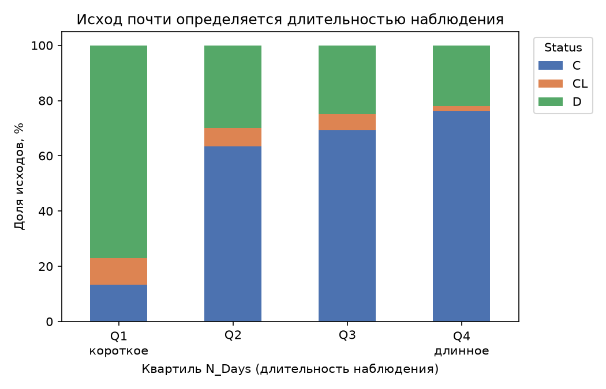

# Medical Status Classification (Mayo Clinic PBC)

Мультиклассовый прогноз исхода при первичном билиарном холангите: **C** (наблюдение прекращено), **CL** (пересадка печени), **D** (смерть).

Данные — [Mayo Clinic PBC](https://raw.githubusercontent.com/vincentarelbundock/Rdatasets/master/csv/survival/pbc.csv) (Fleming & Harrington, 1991): 418 пациентов, 17 признаков. Это тот же датасет, который на Kaggle используется как *original* в [playground-series-s3e26](https://www.kaggle.com/competitions/playground-series-s3e26).

Метрика — **multi-class log loss** (меньше лучше). Оценка на стратифицированной 5-fold CV, повторённой с пятью сидами; в таблицах указан разброс между повторами.

| | log loss | accuracy | balanced accuracy | macro F1 |
|---|---|---|---|---|
| **CatBoost** | **0.6356 ± 0.0140** | **0.7416** | 0.5195 | 0.5082 |
| CatBoost + балансировка классов | 0.6934 ± 0.0131 | 0.7043 | **0.5994** | **0.5805** |
| XGBoost | 0.6843 ± 0.0146 | 0.7206 | 0.5418 | 0.5560 |
| Baseline (априорные вероятности) | 0.8627 | 0.5550 | 0.3333 | 0.2379 |

## Главное: N_Days — это утечка таргета

`N_Days` — число дней от включения в исследование до события: смерти, пересадки или закрытия исследования. То есть это **время до события**, а `Status` — **тип события**. Вместе они составляют исход целиком, поэтому предсказывать одно по другому означает подглядывать в ответ.



Цензурирование наступает в момент закрытия исследования, поэтому у пациента со статусом `C` наблюдение длинное по построению — минимум 691 день, тогда как смерти начинаются с 41 дня. Правило «`N_Days` < 691 ⟹ пациент точно не `C`» выполняется детерминированно, и модель его находит. Один этот признак, без единого анализа крови, даёт accuracy около 0.70 против 0.555 у baseline.

Это артефакт дизайна исследования, а не медицинская закономерность: в момент, когда прогноз реально нужен — при постановке диагноза — `N_Days` неизвестен. Поэтому он исключён из признаков. Цена корректности — примерно 0.06 log loss:

| постановка | CatBoost | XGBoost |
|---|---|---|
| без `N_Days` (прогностическая, по умолчанию) | 0.6356 | 0.6843 |
| с `N_Days` (как на Kaggle, флаг `--with-ndays`) | 0.5785 | 0.6197 |

Если нужно сравнение с лидербордом соревнования, запускай с `--with-ndays`. Для клинически осмысленной задачи — без него.

## Подход

1. **Стратифицированная 5-fold CV с пятью повторами.** В классе `CL` всего 25 примеров: при разбиении 80/20 в валидацию попало бы 5, и метрика зависела бы от сида. Без разброса между повторами невозможно отличить настоящее улучшение от шума.
2. **Пропуски не заполняются.** 106 из 418 пациентов не входили в рандомизированное испытание, поэтому у них нет назначенного препарата и части анализов — сам факт пропуска информативен. И CatBoost, и XGBoost выбирают направление ветвления для NaN сами.
3. **Фиксированные словари кодировки** категорий. `pd.factorize`, применённый к train и test по отдельности, выдаёт разные коды для одних и тех же категорий; здесь кодировка задана явно в `src/train.py`.
4. **Сравнение с baseline.** На несбалансированных данных accuracy 0.74 ничего не значит, пока не видно, что даёт постоянное предсказание мажоритарного класса (0.56).

Все категории либо бинарные, либо упорядоченные (`Edema`: нет < слабый < есть), так что целочисленные коды не навязывают ложного порядка. Масштабирование признаков не используется — деревьям оно не нужно.

## Результаты

Самые сильные признаки — билирубин, возраст, протромбиновое время и тромбоциты. Первые три плюс альбумин на пятом месте — это четыре из пяти составляющих прогностического индекса Mayo для ПБХ, так что модель опирается на клинически осмысленные величины.


## Что проверено и не помогло

Все варианты оценены одинаково — 5 повторов CV в честной постановке. При разбросе около 0.014 всё, что меняет метрику слабее, чем на 0.03, считается шумом.

| Что пробовали | log loss | вывод |
|---|---|---|
| XGBoost на 17 исходных признаках | 0.6843 ± 0.0146 | опорная точка |
| + log-трансформы и индекс Mayo | 0.6872 ± 0.0126 | без эффекта: деревьям монотонные преобразования не нужны |
| + клинические отношения (билирубин/альбумин, APRI) | 0.6998 ± 0.0151 | хуже, лишняя размерность на 418 строках |
| LightGBM вместо XGBoost | 0.7901 ± 0.0197 | заметно хуже на таком объёме |
| **CatBoost вместо XGBoost** | **0.6405 ± 0.0136** | единственный реальный выигрыш, свыше 3 sd |
| CatBoost с подобранными параметрами | **0.6356 ± 0.0140** | итоговая конфигурация |
| CatBoost глубже (depth 6) | 0.6614 ± 0.0216 | переобучение |
| смесь CatBoost + XGBoost | 0.6404 | ничего сверх одного CatBoost |

На датасете такого размера выигрыш дала только смена модели; усложнение признаков стабильно не оправдывалось.

## Ограничения

Класс `CL` не распознаётся: 25 примеров на три класса, и по лабораторным показателям пересадка печени почти не отличается от продолжения наблюдения. Флаг `--balanced` поднимает balanced accuracy с 0.52 до 0.60 и macro F1 с 0.51 до 0.58, но ухудшает log loss с 0.636 до 0.693 — балансировка сдвигает вероятности и портит калибровку. Что важнее, зависит от задачи, поэтому обе конфигурации оставлены.

## Структура

```
src/
  data.py                          # загрузка PBC и приведение к схеме cirrhosis
  train.py                         # кодирование, повторная CV, метрики, графики
notebooks/
  medical_status_xgboost.ipynb     # разбор по шагам, включая проверку утечки
reports/                           # графики, генерируются train.py
requirements.txt
data/                              # не в git — скачивается автоматически
  pbc_raw.csv
```

## Данные

Отдельно скачивать ничего не нужно: `src/data.py` при первом запуске сам заберёт `pbc_raw.csv` в `data/` и приведёт колонки к схеме cirrhosis (`Bilirubin`, `Prothrombin`, `Albumin`, …).

## Запуск

```bash
pip install -r requirements.txt
python src/train.py
```

Скрипт печатает метрики по повторам, сводку против baseline, classification report и сохраняет графики в `reports/`.

Флаги:

```bash
python src/train.py --model xgb        # XGBoost вместо CatBoost
python src/train.py --with-ndays       # постановка как на Kaggle, с утечкой
python src/train.py --balanced         # взвесить классы: выше balanced accuracy
python src/train.py --repeats 1        # быстрый прогон, один сид
```

Ноутбук:

```bash
jupyter notebook notebooks/medical_status_xgboost.ipynb
```

## Стек

Python, pandas, numpy, scikit-learn, CatBoost, XGBoost, matplotlib, seaborn.

Проверено на pandas 3.0.5, scikit-learn 1.9.0, CatBoost 1.2.10, XGBoost 3.4.1.

## Лицензия

[MIT](LICENSE). Датасет PBC распространяется вместе с R-пакетом [survival](https://cran.r-project.org/package=survival).
