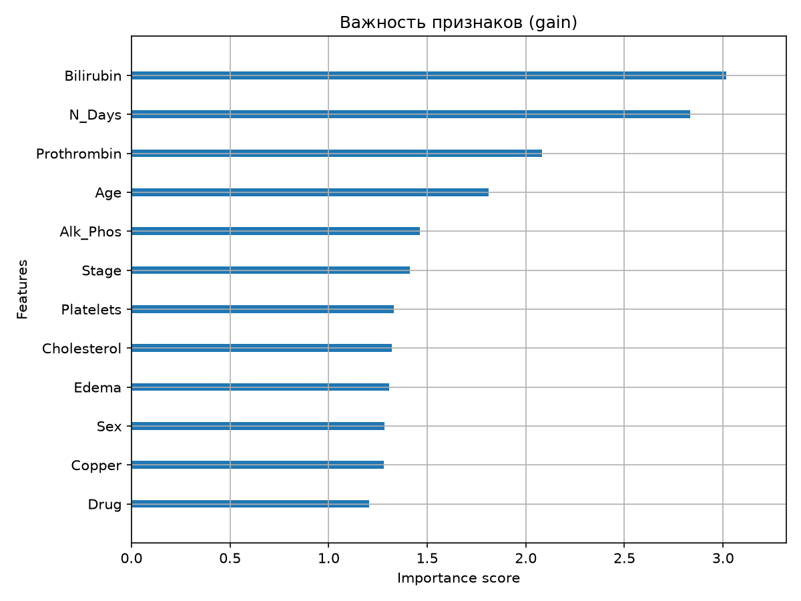
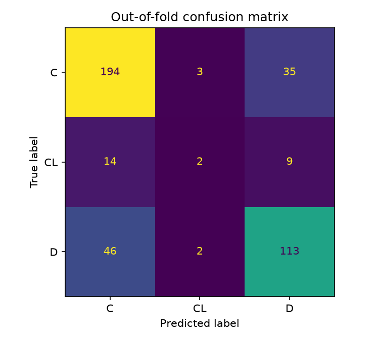

# Medical Status Classification (Mayo Clinic PBC)

Мультиклассовый прогноз исхода при первичном билиарном холангите: **C** (наблюдение прекращено), **CL** (пересадка печени), **D** (смерть).

Данные — [Mayo Clinic PBC](https://raw.githubusercontent.com/vincentarelbundock/Rdatasets/master/csv/survival/pbc.csv) (Fleming & Harrington, 1991): 418 пациентов, 18 признаков. Это тот же датасет, который на Kaggle используется как *original* в [playground-series-s3e26](https://www.kaggle.com/competitions/playground-series-s3e26).

Метрика — **multi-class log loss** (меньше лучше). Оценка на стратифицированной 5-fold CV по out-of-fold предсказаниям.

| | log loss | accuracy | balanced accuracy | macro F1 |
|---|---|---|---|---|
| XGBoost (OOF) | **0.6283** | **0.7392** | **0.5394** | **0.5447** |
| Baseline (априорные вероятности) | 0.8627 | 0.5550 | 0.3333 | 0.2379 |

## Идея

Датасет маленький и сильно несбалансированный, поэтому весь смысл — в честной валидации, а не в подборе гиперпараметров.

1. **Стратифицированная 5-fold CV** вместо одиночного сплита. В классе `CL` всего 25 примеров, при разбиении 80/20 в валидацию попало бы 5, и метрика зависела бы от сида.
2. **Пропуски не заполняются.** 106 из 418 пациентов не входили в рандомизированное испытание, поэтому у них нет назначенного препарата и части анализов — сам факт пропуска информативен. XGBoost выбирает направление ветвления для NaN сам.
3. **Фиксированные словари кодировки** категорий. `pd.factorize`, применённый к train и test по отдельности, выдаёт разные коды для одних и тех же категорий; здесь кодировка задана явно в `src/train.py`.
4. **Сравнение с baseline.** На несбалансированных данных accuracy 0.74 ничего не значит, пока не видно, что даёт постоянное предсказание мажоритарного класса (0.56).

Все категории либо бинарные, либо упорядоченные (`Edema`: нет < слабый < есть), так что целочисленные коды не навязывают ложного порядка. Масштабирование признаков не используется — деревьям оно не нужно.

## Результаты

Самые сильные признаки — билирубин, длительность наблюдения, протромбиновое время и возраст, что совпадает с прогностической моделью Mayo для ПБХ.





## Ограничения

Класс `CL` практически не распознаётся: recall 0.08 при 25 примерах. По лабораторным показателям пересадка печени почти не отличается от продолжения наблюдения, и подбором гиперпараметров это не лечится. Поэтому рядом с accuracy в таблице стоит balanced accuracy — она этот провал показывает.

## Структура

```
src/
  data.py                          # загрузка PBC и приведение к схеме cirrhosis
  train.py                         # кодирование, 5-fold CV, метрики, графики
notebooks/
  medical_status_xgboost.ipynb     # разбор по шагам с выводами
reports/                           # графики, генерируются train.py
requirements.txt
data/                              # не в git — скачивается автоматически
  pbc_raw.csv
```

## Данные

Отдельно скачивать ничего не нужно: `src/data.py` при первом запуске сам заберёт `pbc_raw.csv` в `data/` и приведёт колонки к схеме cirrhosis (`N_Days`, `Bilirubin`, `Prothrombin`, …).

## Запуск

```bash
pip install -r requirements.txt
python src/train.py
```

Скрипт печатает метрики по фолдам, сводку против baseline, classification report и сохраняет графики в `reports/`.

Ноутбук:

```bash
jupyter notebook notebooks/medical_status_xgboost.ipynb
```

## Стек

Python, pandas, numpy, scikit-learn, XGBoost, matplotlib, seaborn.

Проверено на pandas 3.0.5, scikit-learn 1.9.0, XGBoost 3.4.1.

## Лицензия

[MIT](LICENSE). Датасет PBC распространяется вместе с R-пакетом [survival](https://cran.r-project.org/package=survival).
